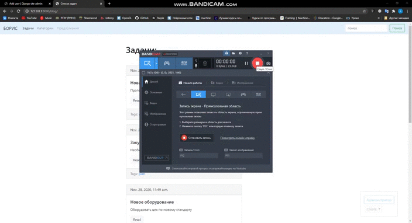
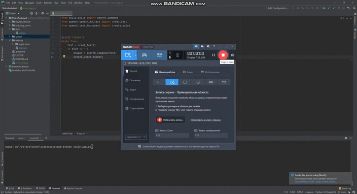

# Boris

## Install
To run the project, you need to install the following dependencies:
* Install all dependencies via [pip](https://pip.pypa.io/en/stable/)
```bash
pip intall -r requirements.txt
```
* To run the project, you must use the download of the following [model](https://drive.google.com/file/d/1mJDZF6ZqdpXS-0uC9YMeV267teThux4U/view?usp=sharing) and put in the model folder

## Use
#### Website
* To run a project on your website, you need to run the following command
```bash
python manage.py runserver
```
* To go to the admin panel http://127.0.0.1:8000/admin/login/?next=/admin/  
Username: admin  
Password: admin

#### Voice assistant
* Command to start from voice assistant
```bash
python voice_app.py
```

